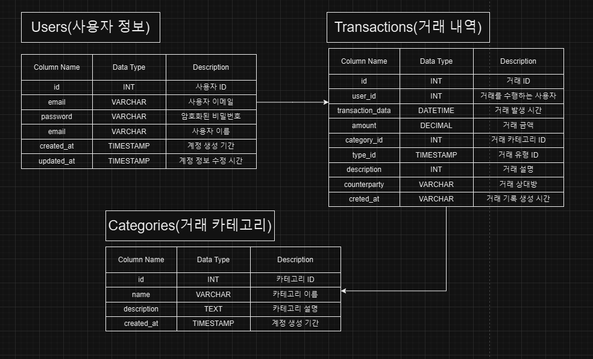

# 🗒 Fintect Project

회원가입 관리 및 사용내역에 대한 실시간 서비스입니다. 

# 프로젝트 기능 및 설계
## 사용자 관리
- 회원가입 기능
  - 사용자는 이메일, 비밀번호, 이름 등의 필수 정보를 입력하여 계정을 생성합니다.
  - 비밀번호는 암호화하여 안전하게 저장되며, 이메일 인증을 통해 가입의 신뢰성을 보장합니다.
  - 회원가입시 아이디와 패스워드를 입력받는다.

- 로그인 기능
  - 사용자는 로그인을 할 수 있다. 로그인시 회원가입때 사용한 아이디와 패스워드가 일치해야한다.
  - 사용자는 이메일과 비밀번호를 입력하여 기존 계정으로 서비스에 접근합니다.
  - 로그인 실패 시 적절한 오류 메시지를 제공하며, 일정 횟수 이상 실패 시 계정을 일시적으로 잠급니다.
  - 안전한 로그인 환경을 위해 JWT 기반 인증

- 회원 탈퇴 기능
  - 탈퇴 시 개인 데이터는 즉시 삭제되거나 서비스 약관에 따라 일정 기간 후 삭제됩니다.
  - 사용자는 설정 메뉴에서 본인 확인 절차를 거쳐 계정을 탈퇴할 수 있습니다.
  - 탈퇴 시 복구 불가능함을 명확히 안내하여 사용자의 결정을 지원합니다.
    
- 비밀번호 재설정
  - 사용자가 비밀번호를 잊은 경우 이메일 인증을 통해 비밀번호를 재설정할 수 있도록 합니다.
- 2단계 인증
  - 로그인 시 추가 보안을 강화합니다.
- 사용자 정보 수정
  - 사용자가 이메일, 비밀번호 등 기본 정보를 변경할 수 있는 기능을 제공합니다.
- 계정 상태 관리
  - 일정시간 이상 사용하지 않으면 계정 비활성화 기능추가하여 휴면 상태로 전환합니다.
    
## 사용자 사용내역 관리
- 사용내역 저장 
  - 용자가 수행한 금융 활동을 자동으로 기록.
  - 내역 데이터에는 날짜, 시간, 카테고리, 금액, 거래 상대방, 설명 등의 필수 필드 포함.
    
- 사용내역 조회
  - 날짜별, 카테고리별, 금액별로 사용내역을 필터링하여 조회 가능.

- 사용내역 분석
  - 월간 지출 요약, 소비 패턴 분석, 예산 대비 사용현황 등을 시각화.
    
## ERD 

